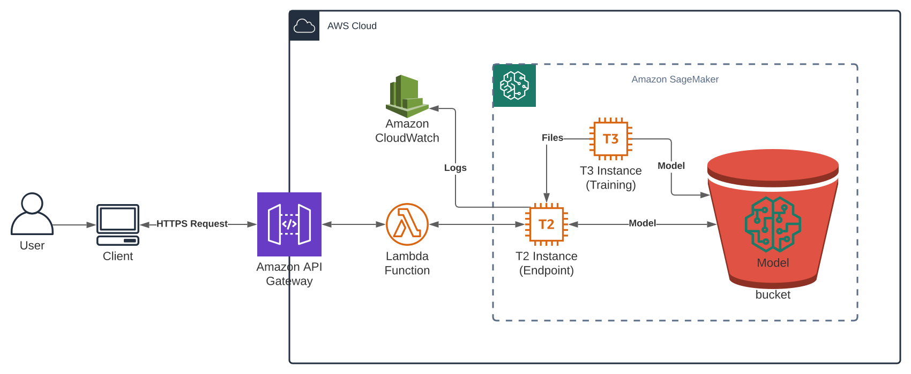

# Violentómetro deployed on AWS

The files contained within this directory and its subdirectories are meant to reflect an exact copy of what's currently deployed on AWS.

## How to deploy

1. Go to AWS Sagemaker > Notebook > Notebook instances.
1. Create a notebook instance with your preferred configuration.
1. Open Jupyter in your created notebook instance.
1. Upload the Python Notebooks (`*.ipynb` files) and the `*.py` files (and its dependencies) inside the `code` directory to the root of the Jupyter Notebook.
1. Execute the cells of `deployment_endpoint.ipynb`.
1. Wait for the endpoint to be created.
1. Execute the cells of `usage_model.ipynb`.
1. If needed, create a role for the AWS Lambda service with the `lambda_sagemaker_InvokeEndpoint_policy` and `AWSLambdaBasicExecutionRole` policies.
1. Create an AWS Lambda with the contents of `lambda_function.py`.
1. Create an API in API Gateway with a method that calls the created AWS Lambda.

## Architecture Diagram

